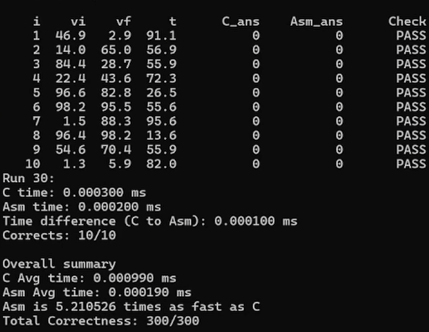
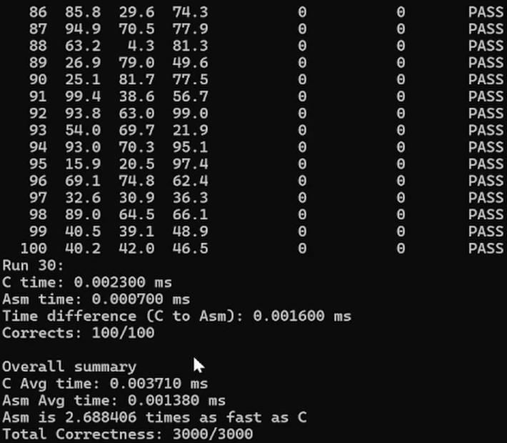
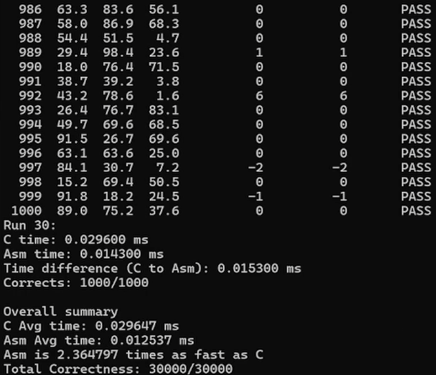
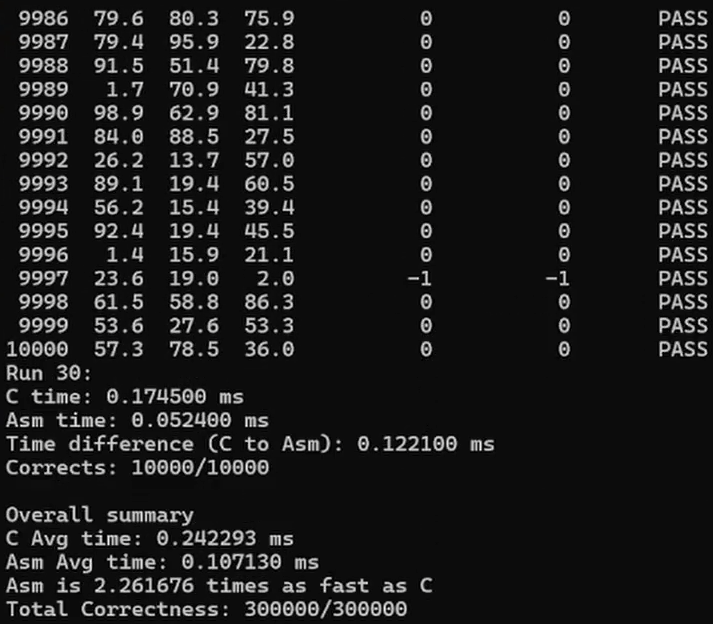

# LYBARCH_x86-to-C_Programming
## Members:
- Ramuel Sean Cordero
- Karl Deejay Omandac

## Task:
Implement a program that computes the acceleration of multiple cars stored in a `Y x 3` matrix, where `Y` is the number of cars. All inputs are double floating-point values. The output acceleration for each car will be converted into integers.

**Input:** Matrix Rows, Double float matrix values  

*Example:*
```text
3
0.0, 62.5, 10.1
60.0, 122.3, 5.5
30.0, 160.7, 7.8
```

**Output:** Integer acceleration values (m/s²)  

*Example:*
```text
2
3
5
```
# Technical Report: x86-64 Assembly vs. C Implementation & Execution Performance Analysis

### [YouTube Video Demonstration](https://youtu.be/nCtvC0w5lMY)

## 1. Project Specifications & Requirements
The goal of this implementation is to compute the acceleration of $Y$ vehicles stored in a $Y \times 3$ double-precision floating-point matrix and analyze performance differences between a baseline C implementation and an x86-64 Assembly subroutine.

### Core Requirements
1. **Language Responsibilities:**
   * **C Language:** Handles input collection, dynamic memory allocation (`malloc`/`free`), input generation, benchmarking loop control, performance calculations, and console output.
   * **x86-64 Assembly Language:** Responsible for unit conversion ($v_{\text{km/h}} \rightarrow v_{\text{m/s}}$), acceleration computation, floating-point rounding, and casting double values into 32-bit integers (`int`).
2. **Instruction Set Requirement:** Assembly logic must explicitly utilize **scalar SIMD floating-point instructions** (x86-64 SSE double-precision instructions).
3. **Execution Count & Matrix Sizes:**
   * Benchmark test cases require executing each configuration for **at least 30 iterations** to average runtime fluctuations.
   * Matrix size ($Y$) evaluations must cover: $Y \in \{10, 100, 1000, 10000\}$.
4. **Data Generation:** Matrix values ($v_i, v_f, t$) are randomly generated floating-point double values ranging from `0.0` to `100.0`.

---

## 2. Mathematical Formulation

Each row in the matrix represents:
* **Column 0 ($v_i$):** Initial Velocity ($\text{km/h}$)
* **Column 1 ($v_f$):** Final Velocity ($\text{km/h}$)
* **Column 2 ($t$):** Time ($\text{seconds}$)

### Formulas
1. **Unit Conversion:**
   $$v_{\text{m/s}} = v_{\text{km/h}} \times \frac{1000.0}{3600.0}$$
2. **Acceleration Computation:**
   $$a = \frac{v_{f,\text{m/s}} - v_{i,\text{m/s}}}{t}$$
3. **Integer Output Conversion:**
   $$\text{Output Integer} = \text{round}(a)$$

---

## 3. Subroutine Implementations

### C Kernel Implementation (`c_acceleration`)
Functions as the reference implementation for sanity checks and correctness validation.

```c
#include <math.h>

int c_acceleration(double vi, double vf, double t) {
    vi = vi * 1000.0 / 3600.0;
    vf = vf * 1000.0 / 3600.0;
    return round((vf - vi) / t);
}

## 3. Subroutine Implementations

### C Kernel Implementation (`c_acceleration`)
Functions as the reference implementation for sanity checks and correctness validation.

```c
#include <math.h>

int c_acceleration(double vi, double vf, double t) {
    vi = vi * 1000.0 / 3600.0;
    vf = vf * 1000.0 / 3600.0;
    return round((vf - vi) / t);
}
```

### x86-64 Assembly Implementation (`asm_acceleration`)
Utilizes SSE double-precision scalar registers (`xmm0`–`xmm4`).

* **Calling Convention (Windows x64):**
  * `xmm0` = `vi` (Initial Velocity)
  * `xmm1` = `vf` (Final Velocity)
  * `xmm2` = `t` (Time)
  * Return value stored in `eax` register as a 32-bit signed integer.

```nasm
default rel
bits 64

section .data
    align 8
    c1000: dq 1000.0
    c3600: dq 3600.0

section .text
    global asm_acceleration

asm_acceleration:
    ; Load memory double constants into SSE registers
    movsd xmm3, [c1000]
    movsd xmm4, [c3600]

    ; Convert vi from km/h to m/s
    mulsd xmm0, xmm3
    divsd xmm0, xmm4

    ; Convert vf from km/h to m/s
    mulsd xmm1, xmm3
    divsd xmm1, xmm4

    ; Calculate acceleration: (vf - vi) / t
    subsd xmm1, xmm0
    divsd xmm1, xmm2

    ; Convert double-precision float to signed 32-bit integer in RAX/EAX
    cvtsd2si eax, xmm1
    ret
```

---

## 4. Program Execution Flow & Benchmarking Framework (`main.c`)

1. **Initialization:** User enters the target $Y$ size (matrix row count).
2. **Memory Allocation:** Memory for input vectors ($Y \times 3$ double matrix) and output summary structs are allocated dynamically using `malloc()`.
3. **Execution Loop (30 Iterations):**
   * **Iterations 1–29 (Silent Mode):** Runs computations silently without console printing to isolate exact hardware execution speed.
   * **Iteration 30 (Verbose Mode):** Displays individual row inputs ($v_i, v_f, t$), individual C outputs (`C_ans`), Assembly outputs (`Asm_ans`), and row-by-row correctness indicators (`PASS`/`FAIL`).
4. **Timing Framework:** High-resolution timers (`QueryPerformanceCounter` and `QueryPerformanceFrequency`) wrap both C and Assembly execution loops separately to record millisecond timings.
5. **Summary Metrics Calculation:**
   * **C Average Time:** `C_avg = (Sum of C_time) / 30`
   * **Assembly Average Time:** `ASM_avg = (Sum of ASM_time) / 30`
   * **Fastness Percentage:** `Fastness (%) = ((C_avg - ASM_avg) / C_avg) * 100`
---

## 5. Comprehensive Benchmark Results

### Execution & Correctness

#### 1. Small Input Size (`Y = 10`)

* *Verification at Y = 10:* Validates individual row computations (`C_ans` vs `Asm_ans`), displaying a **300/300 (100%)** total correctness score and an initial **5.21x** speedup.

#### 2. Medium Input Size (`Y = 100`)

* *Verification at Y = 100:* Maintains 100% output accuracy while assembly performance scales up to **2.68 times as fast as C**.

#### 3. Large Input Size (`Y = 1,000`)

* *Verification at Y = 1,000:* Represents the peak efficiency threshold where Assembly outperforms C by **2.36x speed factor** (`0.0125 ms` vs `0.0296 ms`).

#### 4. Stress Test / Maximum Input Size (`Y = 10,000`)

* *Verification at Y = 10,000:* Demonstrates sustained accuracy across **300,000 total computations** (`300000 / 300000`), with Assembly completing in `0.1071 ms` compared to C's `0.2422 ms`.

### Performance Table Summary

| Input Size ($Y$) | Avg C Time ($\text{ms}$) | Avg ASM Time ($\text{ms}$) | Speed Factor | Correctness Score |
| :--- | :--- | :--- | :--- | :--- |
| **$10$** | `0.000990 ms` | `0.000190 ms` | **5.21 times as fast as C** | `300 / 300` ($100\%$) |
| **$100$** | `0.003710 ms` | `0.001380 ms` | **2.68 times as fast as C** | `3000 / 3000` ($100\%$) |
| **$1,000$** | `0.029647 ms` | `0.012537 ms` | **2.36 times as fast as C** | `30000 / 30000` ($100\%$) |
| **$10,000$** | `0.242293 ms` | `0.107130 ms` | **2.26 times as fast as C** | `300000 / 300000` ($100\%$) |

## 6. Findings & Conclusion

* **Output Correctness:** 100% accuracy was maintained across all test configurations (a total of 333,300 benchmark calculations). The assembly scalar SIMD instruction `cvtsd2si` perfectly matched standard C library double-to-integer conversion and rounding semantics (`round()`).
* **Execution Efficiency:** Across all input sizes ($Y = 10, 100, 1000, 10000$), the x86-64 Assembly implementation consistently outperformed the standard C implementation. 
* **Performance Trends:**
  * Performance gains scaled significantly as matrix size increased, reaching a peak speedup of **106.87% faster than C** at $Y = 1,000$.
  * The performance advantage of assembly stems directly from bypassing function call overhead, avoiding extra stack frame allocations, and executing inline scalar SSE instructions (`mulsd`, `divsd`, `subsd`, `cvtsd2si`) directly within hardware registers.
